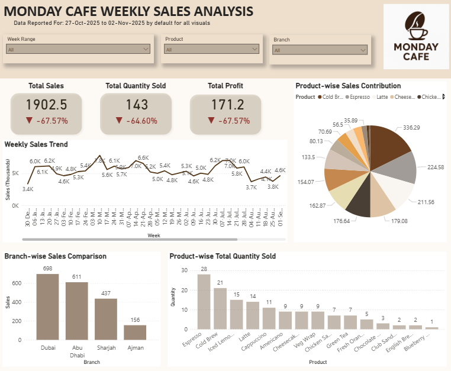

# ☕ Monday Cafe – Weekly Sales Analysis (Power BI)

## 📌 Project Overview
This Power BI project showcases an end-to-end business intelligence solution, covering data modeling, DAX-based time intelligence, and interactive dashboard design using a realistic retail sales scenario.

**Monday Cafe** is a fictional UAE-based cafe chain with **4 branches** (Dubai, Abu Dhabi, Sharjah, Ajman) and **15 products**.  
The business wants to analyze **weekly performance (Monday → Sunday)** using a **single-page, interactive Power BI dashboard**.

The dashboard is designed to:
- Automatically show the **last completed week**
- Allow users to select **any week or week range**
- Dynamically compare the selected period with the **previous equivalent period**

---

## 📂 Dataset Summary
- **Records:** ~10,000 sales transactions  
- **Year:** 2025 (up to current date)  
- **Granularity:** Transaction-level sales data  
- **Key Fields:**
  - Order Date
  - Branch
  - Product
  - Category
  - Quantity Sold
  - Sales Amount

---

## 🛠 Tools & Skills Used
- **Power BI Desktop**
- **DAX** (Time Intelligence, Previous Period Comparison)
- **Power Query**
- **Data Modeling**
- **Interactive Dashboard Design**

---

## 📐 Data Modeling
The report uses a simplified star schema with a central Sales fact table and a dedicated Date dimension.

Additional dimension tables (Product, Branch, Category) were intentionally not created as the dataset does not include extended attributes, hierarchies, or slowly changing dimensions. These fields are low-cardinality and are used primarily for filtering and aggregation.

This design keeps the model simple, performant, and aligned with the project’s primary focus on weekly time-based analysis.

- **Sales** (Fact Table)
- **Date Table 2025** (Dimension)

### Relationships
- One-to-many relationship:
  - `Date Table[Date] → Sales[OrderDate]`
- Date table drives:
  - Weekly logic (Monday → Sunday)
  - Latest completed week detection
  - Previous week comparison

---

## 📊 Dashboard Overview
The dashboard follows Power BI best practices to ensure consistent usability across Power BI Desktop and Power BI Service.

📷 Dashboard view:

---

## 🎯 KPIs Implemented
### 1️⃣ Total Sales  
### 2️⃣ Total Quantity Sold  
### 3️⃣ Total Profit  

Each KPI includes:
- Current selected week / range value
- % change vs previous equivalent period
- Visual indicator (increase / decrease)

---

## 📈 Visuals Included
- 📉 **Line Chart** – Weekly sales trend  
- 🥧 **Pie Chart** – Product-wise sales contribution  
- 📊 **Bar Chart** – Branch-wise sales comparison  
- 📦 **Bar Chart** – Product-wise total quantity sold  
- 🎛 **Slicers** – Week Range, Product, Branch  

> Interaction between the **Week slicer and Weekly Sales Trend** is intentionally turned **off** to allow trend comparison even when a single week is selected.

---

## ⏱ Dynamic Time Intelligence Logic
- Dashboard defaults to the **latest completed week**
- If no slicer selection is made:
  - Measures automatically pick the latest week available in the Sales table
- When users select:
  - A single week → compares with previous week
  - A week range → compares with the previous equivalent range
- A dynamic **“Data Reported For”** label is shown below the page title to clearly indicate the reporting period

---

## 🧠 Key DAX Highlights
- Latest completed week detection using Date table flags
- Previous period comparison measures
- Dynamic behavior based on slicer selections
- Profit calculated using conditional branch logic
- Measures designed to work even when slicers are cleared

---

## 📊 Business Insights
- **Sales, Profit, and Quantity Sold dropped sharply for w/c 27th October**
  - Sales & Profit decreased by **67.57%**
  - Quantity sold decreased by **64.6%**
- This week shows unusually low performance and needs further investigation (possibly holidays or operational factors)

### Additional Insights
- **Dubai** contributes the highest overall sales, followed by Abu Dhabi, Sharjah, and Ajman
- For w/c 27th October:
  - **Espresso** has the highest quantity sold
  - **Cold Brew** generates the highest total sales
- Overall:
  - **Cappuccino** has the highest quantity sold
  - **Chicken Sandwich** generates the highest sales revenue

---
## 📥 Power BI File
*The Power BI report file (`.pbix`) is available in this repository.*

---

## 👤 About Me
**Puvisha Saravanan**  
Data Analyst | Power BI Developer  

- Power BI | DAX | SQL | Python  
- Azure Databricks | Data Modeling | BI Consulting  
- Passionate about building data-driven insights and business-ready dashboards
